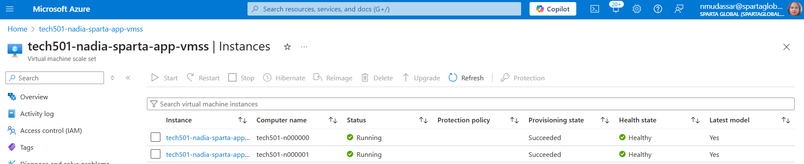

### **Setting Up a Monitoring Dashboard in Azure for a Virtual Machine**

This guide will walk you through setting up a **monitoring dashboard in Azure Monitor** for a Virtual Machine, tracking:

1. **CPU Average**
2. **Network Total (In/Out)**
3. **Disk Operations (Read/Write)**

---

## **Step 1: Navigate to Azure Monitor**

1. **Sign in** to your [Azure Portal](https://portal.azure.com).
2. In the search bar, type **"Monitor"** and select **Azure Monitor**.

---

## **Step 2: Create a New Dashboard**

1. Click on **"Dashboards"** in the Azure portal.
2. Click **"+ New dashboard"** at the top.
3. Give your dashboard a **name** (e.g., `VM-Monitoring-Dashboard`).
4. Choose **Shared Dashboard** if you want others to access it.
5. Click **"Done Customizing"** to save.

---

## **Step 3: Add CPU Usage Chart**

1. In Azure Monitor, go to **Metrics**.
2. Click **"Select a resource"**, choose your **Virtual Machine**.
3. Under **Metrics Namespace**, choose **"Virtual Machine Host"**.
4. In the **Metric dropdown**, select **"Percentage CPU"**.
5. Click the **"Pin to Dashboard"** (📌) icon.
6. Choose **"Existing Dashboard"** and select the dashboard you created.

---

## **Step 4: Add Network Total (In/Out) Chart**

1. Go to **Azure Monitor > Metrics**.
2. Select your **Virtual Machine**.
3. Choose **"Network"** as the Metrics Namespace.
4. Select **"Network In Total"** and **"Network Out Total"**.
5. Click the **"Pin to Dashboard"** (📌) icon and select your dashboard.

---

## **Step 5: Add Disk Operations Chart**

1. Go to **Azure Monitor > Metrics**.
2. Select your **Virtual Machine**.
3. Choose **"Disk"** as the Metrics Namespace.
4. Select **"Disk Read Operations/Sec"** and **"Disk Write Operations/Sec"**.
5. Click the **"Pin to Dashboard"** (📌) icon and select your dashboard.

---

## **Step 6: Customize the Dashboard**

1. **Go to your dashboard** from the Azure portal.
2. Click **"Edit"** to adjust the chart sizes and arrangement.
3. Drag and resize **CPU, Network, and Disk charts** for a clean layout.
4. Click **"Done Customizing"** to save.

---

## **Step 7: Adjust Time Range & Refresh Rate**

1. On the dashboard, look for the **Time Range** dropdown.
2. Set it to **Last 30 minutes / 1 hour / 24 hours** as needed.
3. Enable **Auto Refresh** for real-time monitoring.

---

---

### **Using Apache Bench (ab) to Load Test Your Azure Virtual Machine**

Apache Bench (`ab`) is a command-line tool for **load testing web servers**. You can use it to **simulate multiple requests** to your Azure Virtual Machine and monitor its performance using the dashboard you set up.

---

## **Step 1: Install Apache Bench (ab)**

If you don’t have `ab` installed, use the following commands:

- **On Ubuntu/Debian:**

  ```bash
  sudo apt update
  sudo apt install apache2-utils -y

  ```

---

## **Step 2: Run Apache Bench on Your Virtual Machine**

1. **Find Your Web Server IP or Domain**

   - If your VM hosts a **web application**, get its **Public IP** from the Azure portal.
   - Example: `http://<VM-PUBLIC-IP>/`

2. **Basic Load Test Command**

   ```bash
   ab -n 100 -c 10 http://<VM-PUBLIC-IP>/
   ```

   - `-n 100` → Total number of requests.
   - `-c 10` → Number of concurrent requests.

3. **Aggressive Load Test**
   ```bash
   ab -n 1000 -c 100 http://<VM-PUBLIC-IP>/
   ```
   - Sends **1000 requests** with **100 concurrent users**.

---

## **Step 3: Monitor Performance in Azure Dashboard**

1. Go to **Azure Portal > Monitor > Dashboards**.
2. Check metrics:
   - **CPU Usage** should spike as `ab` increases the load.
   - **Network In/Out** should increase as requests are handled.
   - **Disk Read/Write Operations** may also increase.

---


