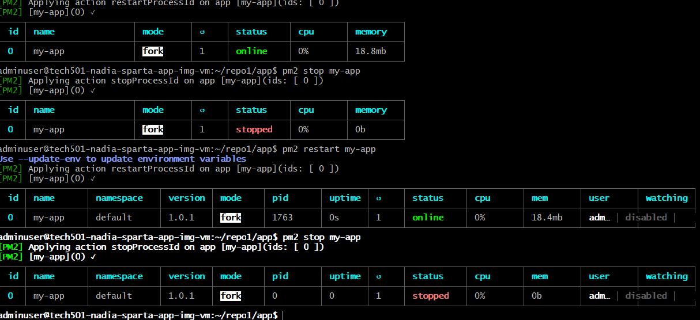

- [PM2 Process Management for Node.js Application](#pm2-process-management-for-nodejs-application)
  - [Prerequisites](#prerequisites)
  - [Steps to Manage the Node.js Application](#steps-to-manage-the-nodejs-application)
    - [1. **Navigate to the Application Directory**](#1-navigate-to-the-application-directory)
    - [2. **Start the Application with PM2**](#2-start-the-application-with-pm2)
    - [3. **Restart the Application**](#3-restart-the-application)
    - [4. **Stop the Application**](#4-stop-the-application)
    - [5. **Check PM2 Logs**](#5-check-pm2-logs)
    - [6. **Update Environment Variables (Optional)**](#6-update-environment-variables-optional)
    - [7. **Make PM2 Start on Boot**](#7-make-pm2-start-on-boot)
    - [8. **Manage Multiple Processes**](#8-manage-multiple-processes)
  - [Troubleshooting](#troubleshooting)
  - [Example PM2 Commands](#example-pm2-commands)
# PM2 Process Management for Node.js Application

This README provides instructions for managing your Node.js application using PM2, including starting, restarting, and stopping your app, as well as some troubleshooting tips.

## Prerequisites

Before you begin, ensure that you have the following installed on your machine:

- Node.js
- PM2

If PM2 is not installed globally, you can install it using the following command:

```bash
sudo npm install -g pm2
```

## Steps to Manage the Node.js Application

### 1. **Navigate to the Application Directory**

Navigate to the directory where your Node.js application is located:

```bash
cd ~/repo1/app
```

### 2. **Start the Application with PM2**

To start the application using PM2 and name the process `my-app`:

```bash
pm2 start app.js --name "my-app"
```

This will launch the app in fork mode (one instance). You can check the status of the app using:

```bash
pm2 list
```

### 3. **Restart the Application**

To restart the application, use the following command:

```bash
pm2 restart my-app
```

### 4. **Stop the Application**

To stop the application, use:

```bash
pm2 stop my-app
```

### 5. **Check PM2 Logs**

To check the logs for the running application, use:

```bash
pm2 logs my-app
```

This will show you the output and errors generated by the app.

### 6. **Update Environment Variables (Optional)**

If you need to update environment variables, you can use the `--update-env` flag during the restart:

```bash
pm2 restart my-app --update-env
```

### 7. **Make PM2 Start on Boot**

To ensure that PM2 and your application start automatically after a system reboot, run:

```bash
pm2 startup
```

Then save the process list to ensure that the application will be managed correctly:

```bash
pm2 save
```

### 8. **Manage Multiple Processes**

If you need to manage multiple instances of your application for load balancing, you can specify the number of instances using the `-i` flag:

```bash
pm2 start app.js -i 4 --name "my-app"
```

This will start 4 instances of the app in a load-balanced configuration.

---

## Troubleshooting

- **Process or Namespace Not Found Error**: If you encounter errors such as `[PM2][ERROR] Process or Namespace app not found`, ensure that the application was started correctly by checking the list of processes:

  ```bash
  pm2 list
  ```

  If the process is not listed, start the application again with:

  ```bash
  pm2 start app.js --name "my-app"
  ```

- **Logs Not Showing Expected Output**: If you're not seeing the logs you expect, ensure that the app is logging correctly. Check for issues within the application that might prevent it from running properly.

---

## Example PM2 Commands

- **Start the app**:

  ```bash
  pm2 start app.js --name "my-app"
  ```

- **Restart the app**:

  ```bash
  pm2 restart my-app
  ```

- **Stop the app**:

  ```bash
  pm2 stop my-app
  ```

- **View logs**:

  ```bash
  pm2 logs my-app
  ```

- **Show PM2 process list**:

  ```bash
  pm2 list
  ```

---


