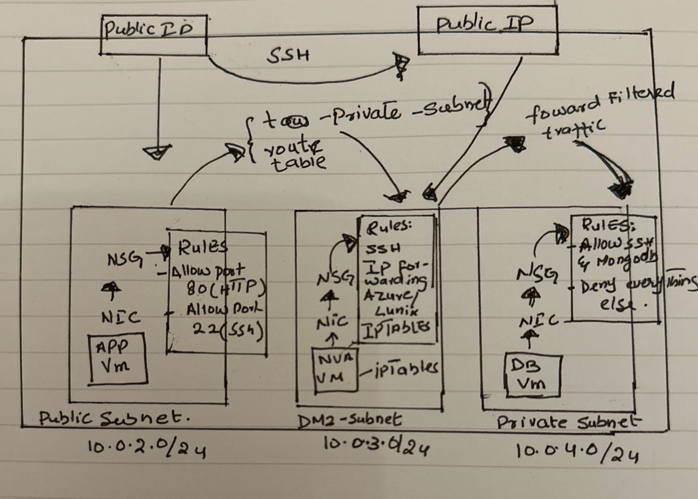

---

# Database Security with a 3-Subnet Network Architecture

This guide provides a step-by-step approach to securing a database using a 3-subnet architecture in Azure. The architecture is designed to segregate network traffic, where the database resides in a private subnet, the application runs in a public subnet, and a DMZ subnet acts as a traffic filter via a Network Virtual Appliance (NVA).

## Contents

- [Overview of the Architecture](#overview-of-the-architecture)
- [Network Plan](#network-plan)
  - [Virtual Network Setup](#virtual-network-setup)
  - [Public Subnet Configuration](#public-subnet-configuration)
  - [Private Subnet Configuration](#private-subnet-configuration)
  - [DMZ Subnet Configuration](#dmz-subnet-configuration)
- [Hands-on Lab](#hands-on-lab)
  - [Create a Virtual Network](#create-a-virtual-network)
  - [Deploy the Database VM](#deploy-the-database-vm)
  - [Deploy the Application VM](#deploy-the-application-vm)
  - [Accessing the Application VM](#accessing-the-application-vm)
  - [Testing Database Connectivity](#testing-database-connectivity)
- [Setting Up the Network Virtual Appliance (NVA)](#setting-up-the-network-virtual-appliance-nva)
  - [Configure Routing Table](#configure-routing-table)
- [Enable IP Forwarding](#enable-ip-forwarding)
- [Configure IP Tables](#configure-ip-tables)
- [Database Security Enhancements](#database-security-enhancements)
- [Resource Cleanup](#resource-cleanup)

---

## Overview of the Architecture

This architecture leverages three subnets in Azure to secure communication to the database:

1. **Public Subnet**: Hosts the Application VM (App VM).
2. **Private Subnet**: Hosts the Database VM (DB VM), isolated from direct internet access.
3. **DMZ Subnet**: Houses the NVA, which acts as a firewall to filter traffic between the app and database.

---

## Network Plan

### Virtual Network Setup

- **CIDR Block**: 10.0.0.0/16

### Public Subnet Configuration

- **CIDR Block**: 10.0.2.0/24
- The App VM in this subnet has a public IP.
- **Network Security Group (NSG) Rules**:
  - Allow HTTP (Port 80).
  - Allow SSH (Port 22).

### Private Subnet Configuration

- **CIDR Block**: 10.0.4.0/24
- The DB VM resides here with no public IP to prevent direct external access.
- **NSG Rules**:
  - Allow SSH and MongoDB traffic.
  - Block all other traffic for enhanced security.

### DMZ Subnet Configuration

- **CIDR Block**: 10.0.3.0/24
- The NVA is placed here to filter traffic.
- **IP Forwarding** must be enabled for traffic routing between subnets.
- **NSG Rules**:
  - Allow SSH access initially for configuration.

---

## Hands-on Lab

### Create a Virtual Network

- Set up a virtual network with three subnets: Public, Private, and DMZ.

### Deploy the Database VM

- **VM Name**: `tech501-nadia-in-subnet-sparta-app-db`
- **Subnet**: Private
- **No Public IP** assigned.
- **Allowed Ports**: Only SSH (Port 22).

### Deploy the Application VM

- **VM Name**: `tech501-nadia-in-3-subnet-sparta-app-vm`
- **Subnet**: Public
- **NSG Rules**:
  - Allow HTTP (Port 80) and SSH (Port 22).
- Add the following script to your VM's user data:
  ```bash
  #!/bin/bash
  cd /repo/app
  export DB_HOST=mongodb://10.0.4.4:27017/posts
  pm2 start app.js
  ```

### Accessing the Application VM

- Use the following command to SSH into the App VM:
  ```bash
  ssh -i ~/.ssh/tech501-nadia-az-key adminuser@20.26.237.241
  ```

### Testing Database Connectivity

- From the App VM, test connectivity to the DB VM:
  ```bash
  ping 10.0.4.4
  ```

---

## Setting Up the Network Virtual Appliance (NVA)

- **VM Name**: `tech501-nadia-in-3-subnet-sparta-app-nva`
- **Subnet**: DMZ
- **NSG Rules**: Allow SSH access.
- **Public IP**: Enable for initial access.

### Configure Routing Table

- Set up a routing table to route traffic from the Public subnet to the NVA and then to the DB VM:
  - **Destination CIDR Block**: 10.0.4.0/24 (Private Subnet).
  - **Next Hop**: Virtual Appliance (NVA IP).

---

## Enable IP Forwarding

1. **In Azure**:

   - Enable IP forwarding for the NVA VM's network interface.

2. **In Linux**:
   - SSH into the NVA and run:
     ```bash
     sudo nano /etc/sysctl.conf
     # Uncomment the line:
     net.ipv4.ip_forward=1
     sudo sysctl -p
     ```

---

## Configure IP Tables

Set up IP tables to restrict traffic and only allow necessary communication between the app VM and the DB VM. Create a bash script for automated configuration:

```bash
#!/bin/bash
sudo iptables -A INPUT -i lo -j ACCEPT
sudo iptables -A OUTPUT -o lo -j ACCEPT
sudo iptables -A INPUT -m state --state ESTABLISHED,RELATED -j ACCEPT
sudo iptables -A OUTPUT -m state --state ESTABLISHED -j ACCEPT
sudo iptables -A FORWARD -p tcp -s 10.0.2.0/24 -d 10.0.4.0/24 --destination-port 27017 -m tcp -j ACCEPT
sudo iptables -P INPUT DROP
sudo iptables -P FORWARD DROP
```

Run the script to apply the rules.

---

## Database Security Enhancements

- **NSG Configuration**: Modify the NSG for the DB VM to only allow MongoDB traffic from the app VM (10.0.2.0/24).
- Block all other incoming traffic to the DB VM.

---

## Resource Cleanup

1. **VMs**: Delete the created VMs.
2. **Route Table**: Disassociate and delete the routing table.
3. **Virtual Network**: Remove the virtual network after detaching any associated resources.


