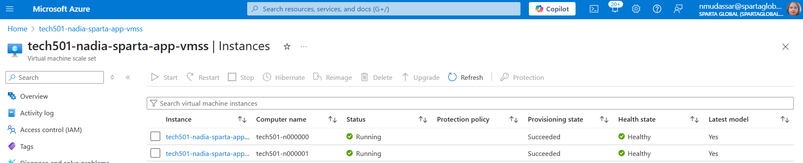

# README - Azure VM Scale Set Creation & Monitoring

## **Overview**

This guide provides steps to:

1. **Set up a Virtual Machine Scale Set (VMSS) in Azure**
2. **Enable Auto-scaling and Monitoring for Performance**
3. **Access Instances and Perform SSH Connections**
4. **Configure Load Balancing for Efficient Traffic Distribution**

---

## **1. Setting Up an Azure VM Scale Set**

### **Step 1: Navigate to Azure VM Scale Sets**

1. Sign in to the [Azure Portal](https://portal.azure.com).
2. Search for **"Virtual Machine Scale Sets"** and click **Create**.

### **Step 2: Define Scale Set Parameters**

1. **Resource Group:** Use an existing one or create a new one.
2. **Scale Set Name:** Provide a name (e.g., `Tech501-ScaleSet`).
3. **Region:** Select an appropriate Azure region.
4. **Availability Zones:** Select **All Three Zones** for redundancy.
5. **Orchestration Mode:** Choose **Uniform** (Ensures consistent VM size and configuration).
6. **Scaling Mode:** Select **Auto-scaling**.

### **Step 3: Configure Auto-scaling**

1. Click the **Edit (✏️) button** to modify scaling rules.
2. **Set instance count:**
   - Minimum: `2`
   - Maximum: `3`
3. **CPU Threshold:** Set **75%** for scaling out and **20%** for scaling in.
4. Click **Save** to apply the changes.

### **Step 4: Choose an Image & VM Size**

1. Click **See All Images** and select a pre-tested custom image.
2. Choose an appropriate VM size (e.g., **B1S** for basic usage).
3. Set up **Administrator Access**:
   - Use an SSH public key for secure authentication.

### **Step 5: Configure Disks & Networking**

1. **Disk Type:** Select **Standard SSD**.
2. **Networking:**
   - Use an existing **Virtual Network (VNet)**.
   - Assign the **Public Subnet**.
   - Configure the **Network Security Group (NSG)** to allow necessary ports.

### **Step 6: Load Balancer Configuration**

1. Select **Azure Load Balancer** and create a new one.
2. Name the Load Balancer (`Tech501-LB`).
3. Set to **Public** for external access.
4. Ensure **Health Probes** check instances on **Port 80**.
5. Define **Inbound NAT Rules** for SSH access:
   - Instance 1: Port `50000`
   - Instance 2: Port `50001`

### **Step 7: Enable Health Monitoring & Auto Repairs**

1. Enable **Application Health Monitoring** on Port **80**.
2. Enable **Automatic Repairs** with a **10-minute grace period**.

### **Step 8: Add Custom User Data (Startup Script)**

1. In the **Advanced** tab, enter the startup script.
2. Example:
   ```bash
   #!/bin/bash
   cd /app-folder
   pm2 start app.js
   ```
3. Ensure **User Data** is tested and works correctly.

### **Step 9: Review & Deploy**

1. Assign appropriate **Tags** for identification.
2. Click **Create** to deploy the Scale Set.

---

## **2. Accessing VM Instances in Scale Set**

### **Step 1: Retrieve Load Balancer Public IP**

1. Go to **Azure Portal > Load Balancer > Overview**.
2. Copy the **Public IP Address**.

### **Step 2: SSH into Instances**

1. Open a terminal and connect via SSH:
   ```bash
   ssh -i <your-key.pem> azureuser@<LOAD_BALANCER_PUBLIC_IP> -p 50000
   ```
2. To access the second instance, change the port:

   ```bash
   ssh -i <your-key.pem> azureuser@<LOAD_BALANCER_PUBLIC_IP> -p 50001

   ```

## **5. Cleanup & Deletion**

### **Step 1: Delete Scale Set & Load Balancer**

1. Go to **Virtual Machine Scale Sets** > **Select Your Scale Set**.
2. Click **Delete**.
3. Go to **Load Balancer** > **Select Your Load Balancer**.
4. Click **Delete**.

### **Step 2: Verify Resources are Removed**

1. Check **Azure Resource Group** for remaining resources.
2. Ensure all unnecessary instances are removed.

---

# Daigram

            +--------------------------+
            |  Azure Load Balancer     |
            |  Public IP: X.X.X.X      |
            +--------------------------+
                        |

---

| | |
+-----------+    +-----------+ +-----------+
| VM Instance | | VM Instance | | VM Instance |
| (VMSS-1) | |  (VMSS-2) | | (VMSS-3) |
| Private IP | | Private IP | | Private IP |
+-----------+ +-----------+ +-----------+
| | |

---

                        |
          +--------------------------------+
          |  Azure Virtual Network (VNet) |
          |  Subnet: Public Subnet        |
          +--------------------------------+

